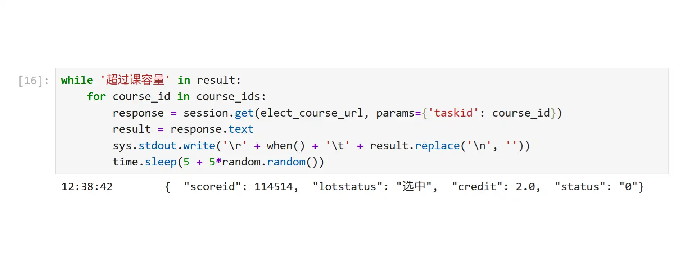

# pumc-course-select

[北京协和医学院研究生选课系统](https://graduatexk.pumc.edu.cn/graduate/index.do)抢课脚本

---

## 使用方法

为了便于开发及交互，本脚本使用 Jupyter Lab 开发。

1. Python

  你可以安装 Jupyter Lab，也可以在纯 Python 环境下安装依赖后复制代码运行。

  使用 [uv](https://docs.astral.sh/uv/) 安装依赖的方式：

  `uv sync`

  或者

  `uv add opencv-python oldest-supported-numpy numexpr pytesseract requests pillow`

  使用 conda (推荐 [miniforge](https://github.com/conda-forge/miniforge)) 安装依赖的方式：

  `conda create -n myenv jupyterlab ipykernel requests opencv pillow pytesseract numpy numexpr`

  当前如果是 Python 3.14，需要添加参数 `-c anaconda`。

2. Tesseract

  请参照[文档](https://github.com/tesseract-ocr/tesseract?tab=readme-ov-file#installing-tesseract)。

目前暂无推出独立程序的计划。

---

## Q&A

* 这个脚本有什么作用？
  
  适用于开放选课后没抢到心仪课程的场景，持续尝试选课，当有人退课时即可选中。原理类似于12306的候补功能或远古时代的抢票浏览器。

* 成功率如何？
  
  根据身边统计学，当天捡漏几率为100%。

---

## 其他

* 精神前作：[1](https://github.com/KumaTea/SYSU-Student-Evaluation) [2](https://github.com/KumaTea/SYSU-CAS)
